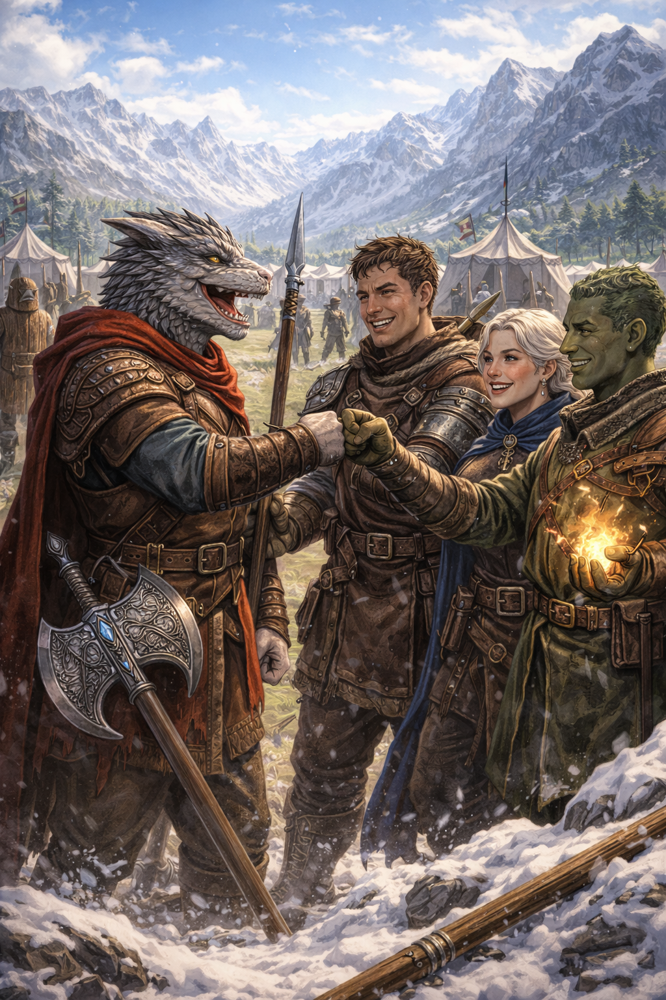

---
title:
draft:
aliases:
type: Player
faction:
location: Party
description: Silver Dragonborn Barbarian
level: 1
disposition:
player: Josh G
tags:
status: Alive
image: "[[Valkryth Skysunder.jpeg]]"
---
![[Valkryth Skysunder Statblock.png]]

### Description
*The Frost Warden of the Storm Cleaving Clan* 
Silver Dragonborn
Age 40

### Level & Knowledge
Barbarian (Path of the Zealot)
Draconic

### Keepsake
![[Karruth Vokur Keepsake.png]]

%%
##### Frostmantle Echo
_Trigger: Ally drops to 0 HP._
You hear a whisper in Draconic.
You gain advantage on one roll before end of next turn.

After this is used 3 times upgrade the dagger

##### “Not Again.”
Once per long rest, when an ally within 30 feet drops to 0 HP:
- You may immediately move up to your speed toward them.
- You gain resistance to all damage until the start of your next turn.
- You cannot move away from that ally until your next turn.

##### Cold Shoulder
As a reaction, when an ally takes damage within 5ft you can reduce the damage by 1d6 and deal the same as cold reflected damage
%%

### Personal Quest
*Goals, motives, ideas*

### Relationships
#### Family
- Varex & Selmira (Parents)
- Ryn and Velra (younger siblings) - deceased

#### Friends
- Kaelor Thrice-Bound, a human spearfighter with a sharp tongue and sharper instincts.
- Miraak Stonebloom, an earth genasi medic who kept the group alive more times than they could count.
- Syrala Vexwind, a halfelf scout whose calm presence steadied Valkryth’s temper.

### Backstory
Homeland: The Cliffkeep Mountains, Tal’Dorei

Valkryth Skysunder was born in the high valleys of the Cliffkeep Mountains, where the air was thin, the winds sharp, and the silver-scaled clans lived in tightknit communities carved into the stone. His childhood was—by all accounts—pleasant, even idyllic. His parents, Varex and Selmira, were respected hunters and guides who taught him early the value of honesty, hard work, and the quiet pride of service to one’s people.

The Skysunder household was always full of warmth despite the mountain chill. His mother sang old Draconic lullabies while tending the hearth; his father told stories of ancient wyrms and the honour of the Dragonborn clans. Valkrythgrew up alongside two younger siblings—twins, Ryn and Velra—who adored him and followed him everywhere. He spent his youth learning to climb sheer cliffs, track mountain elk, and wrestle in the snow with other young Dragonborn. He was strong early—broadshouldered, quick to laugh, and fiercely protective of those he loved. Nothing in his youth hinted at the storms that would one day shape him.

At sixteen, as was tradition for many in the region, Valkryth volunteered for service in the local militia of the [[Cliffkeep Mountains]] —an  armed force responsible for defending the passes, escorting caravans, and supporting the greater [[Tal’Dorei Council]] when called upon. He was eager, proud, and determined to prove himself. Training came naturally. His strength was undeniable, but it was his loyalty and willingness to throw himself into danger for others that earned him early respect. He bonded quickly with a small group of recruits who would become his closest companions:

- Kaelor Thrice-Bound, a human spearfighter with a sharp tongue and sharper instincts.
- Miraak Stonebloom, an earth genasi medic who kept the group alive more times than they could count.
- Syrala Vexwind, a halfelf scout whose calm presence steadied Valkryth’s temper.

They trained together, bled together, and soon enough, marched to war together. When Valkryth was twenty, [[Tal'Dorei]] was pulled into a brutal conflict along its northern borders—an incursion of organized raiders, mercenary companies, and monstrous forces driven by a mysterious warlord seeking to carve out a kingdom in the mountains. The [[Frostgiant Clan]], hailing from the [[Neverfields]], was roped into the conflict. The fighting was relentless, fought in narrow passes and frozen ravines where ambushes were constant and mercy was rare.

Valkryth’s unit was deployed to the front lines for nearly three years. He learned quickly that war was nothing like the heroic tales his father once told. It was mud, blood, and the screams of the dying echoing off stone walls. He fought with a fury that frightened even him at times—an instinctive, primal rage that surged when his allies were threatened. His companions became his anchor, the only thing keeping him from losing himself entirely.

During the Siege of [[Frostmantle Pass]], Valkryth’s younger siblings, Ryn and Velra—now adults and newly enlisted—were assigned to a reinforcement battalion. Valkryth begged the commanders to keep them away from the front, but the war cared little for family ties.

During a night assault, the enemy detonated charges beneath the cliffside, collapsing part of the pass. Valkryth’s unit survived, but the reinforcement battalion—his siblings among them—was buried under tons of stone and ice.
Valkryth clawed at the rubble with his bare hands until they bled. His companions had to drag him away before the enemy counterattack arrived. The loss carved a permanent scar into him, one that never fully healed.

 In the aftermath of the battle, while searching the ruins for survivors, Valkryth found a dagger unlike any he had seen. Its blade was forged of pale, almost translucent metal that shimmered faintly like frost under moonlight. Draconic runes spiraled along the hilt, speaking of protection, remembrance, and sacrifice. It was found clutched in the hand of a fallen Dragonborn soldier—someone Valkryth did not know, but whose final posture suggested they had died shielding others from the collapse. Valkryth took the dagger not as loot, but as a vow. He named it “Karruth Vokur” (Gravemourn), and it became his most treasured keepsake—a reminder of the cost of war, the weight of duty, and the promise he made to never let those beside him fall if he could stand in their place.

The war eventually ended in victory, but it was a hollow one. The enemy warlord was slain, the [[Frostgiant Clan]] banished, the raiders scattered, and the passes reclaimed - but thousands had died. Valkryth returned home to grieving parents and a community forever changed.

He stayed with his family for a time, helping rebuild, but the mountains no longer felt like the same home. Too many echoes of the past lingered in every shadowed corner.

Seeking purpose, Valkryth accepted a position in the regional guard company serving the leader of the Cliffkeep region—a prestigious role reserved for veterans of exceptional discipline and honour. For ten years he served faithfully, protecting diplomats, patrolling the borders, and ensuring peace in the aftermath of the war.

 He became known for his unwavering reliability, his intimidating presence, and his fierce devotion to those under his protection. His companions from the war remained in his life, though scattered across [[Tal'Dorei]]. Whenever they reunited, it was as if no time had passed.

Yet beneath the calm exterior, Valkryth felt a growing restlessness. The world beyond the mountains called to him. Tal’Dorei was changing—new threats rising, old powers stirring—and he felt the pull of destiny once more.

At forty years old, Valkryth Skysunder is a seasoned warrior with a gentle heart and a storm raging beneath the surface. He carries Karruth Vokur at his side, the memory of his siblings in his chest, and the unbreakable loyalty to his surviving companions in his soul.

He seeks purpose, redemption, and perhaps a chance to protect others in a way he once could not. Whether fate leads him to adventure, heroism, or sacrifice, he walks forward with the strength of the mountains behind him.
